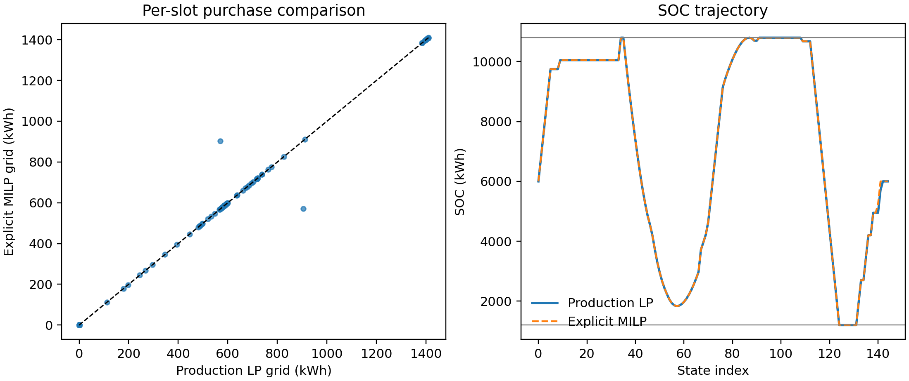
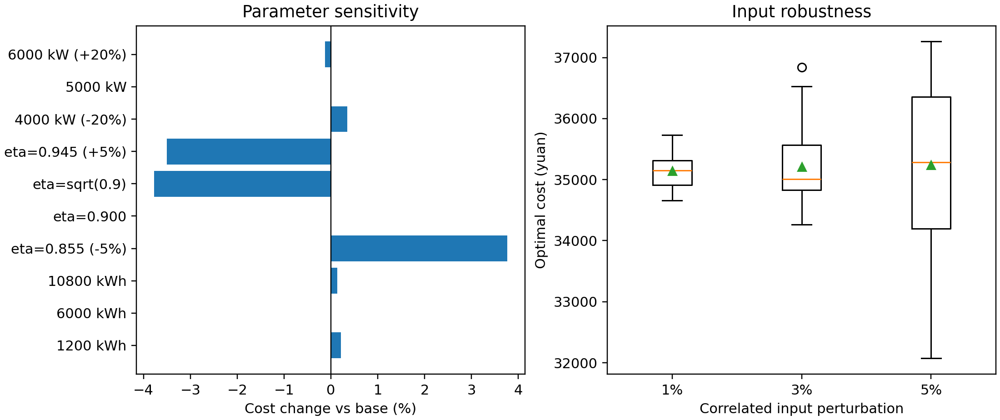

# C 题 Q1 正式结果验证报告

## 1. 验证对象与结论

验证对象为 D003 方案 A 下的正式结果：`outputs/q1_scheme_a/q1_dispatch.csv`、`result1.xlsm`、`q1_paper_tables.json` 和 `q1_audit.json`。验证脚本 `src/validate_q1.py` 不导入生产 `core` 包，直接读取正式 CSV 与附件 1，并另建显式 SOC、充放电互斥的 MILP。

**结论：当前 Q1 结果可信，可以进入论文。** 未发现数据泄漏、单位换算、索引顺序、缺失/重复、物理约束或导出不一致等基础错误；正式 CSV 未修改。最大剩余风险是 D003 的时间边界解释，其次是“充、放电效率各为 90%”这一题意口径，而不是数值求解稳定性。

## 2. 当前模型与计算链

- 问题：已知单日分时电价、负荷和光伏预测，确定 144 个 10 分钟时段的购电、充电和放电量，使供需平衡、SOC 与功率合法且周期末库存回到初值，最小化购电费。
- 输入：附件 1 的 144 个价格、负荷功率和光伏预测功率；电池参数；`E_0=E_144=6000 kWh`。
- 预处理：按 D003 方案 A 位置对齐；功率乘 `1/6 h` 转为每格电量；数据必须恰为 144 项。
- 模型：母线侧确定性 LP，`g+pv_used+d=load+c`，`E_{t+1}=E_t+0.9c-d/0.9`；允许弃光、禁止反送。先最小化费用，再在 `1e-7` 费用容差内最小化充放电吞吐。
- 输出链：LP → 执行器 → 独立核算器 → `q1_dispatch.csv` → 官方模板和论文表格回读。
- CSV 列：槽位及起止时间；价格、负荷、可用/使用/弃置光伏；合同/交付/未用/紧急购电；充放电；槽首/槽末 SOC；平衡残差；正常/紧急费用。

Q1 不拟合预测器、不估计经验参数，传统随机 K-fold 没有验证对象，反而会把确定性优化误写成统计学习。本次采用逐槽独立复算、替代优化模型、参数敏感性和有界输入扰动。

## 3. 独立逐槽复核

独立脚本从附件 1 重新读取 144 行，不调用 `data_io`、LP、执行器或核算器。它对全部槽位复算 `kW×1/6=kWh`、供需平衡、SOC 转移、光伏恒等式和费用，并另外输出边界槽、负荷/电价极值槽、SOC 边界槽、典型净负荷槽及固定种子随机槽。

| 检查 | 结果 |
|---|---:|
| CSV 行数 / 缺失 / 重复槽 | 144 / 0 / 0 |
| 原始价格最大绝对误差 | 0 |
| 负荷换算最大绝对误差 | `1.14e-13 kWh` |
| 光伏换算最大绝对误差 | `2.27e-13 kWh` |
| 能量平衡最大残差 | `2.27e-13 kWh` |
| SOC 转移最大误差 | `1.82e-12 kWh` |
| 相邻 SOC 断链最大误差 | 0 |
| 单槽费用最大误差 | `1.14e-13 元` |
| SOC/功率/Q1 语义违反 | 0 / 0 / 0 |
| 同时充放电槽数 | 0 |

独立复算总购电量为 `59482.698998 kWh`，总费用为 `35126.948589 元`；`E_0`、`E_143` 和 `E_144` 均为 `6000 kWh`。正式工作簿购电量与 CSV 的最大差为 `6.82e-13 kWh`，论文表 1、表 2 的汇总误差均为 0。

## 4. 替代方法交叉验证

替代模型显式保留 145 个 SOC 状态，并为每槽加入二进制变量，强制充电和放电互斥。该模型不复制主模型“消去 SOC”的矩阵结构，也不使用生产核心函数。

| 指标 | 结果 |
|---|---:|
| 主 LP 费用 | `35126.948589389630 元` |
| 显式互斥 MILP 费用 | `35126.948589389634 元` |
| 绝对 / 相对费用差 | `7.28e-12 元` / `2.07e-16` |
| 逐槽购电 MAE / RMSE | `4.630 / 39.284 kWh` |
| 逐槽购电最大差 | `333.333 kWh` |
| 逐槽购电 Pearson 相关系数 | `0.995576` |
| SOC 轨迹最大差 | `300.000 kWh` |
| MILP 同时充放电槽数 | 0 |

逐槽最大差只出现在两个价格同为 `0.4240 元/kWh` 的时段：两模型把 `333.333 kWh` 购电在等价时段间互换，因而费用、总能量和最终 SOC 不变。这属于多重最优解，不是异常。无储能可行基线费用为 `48052.046591 元`；主方案节省 `12925.098001 元`，降幅 `26.8981%`。



## 5. 敏感性与稳健性

| 扰动组 | 费用变化范围 | 判断 |
|---|---:|---|
| 初始 SOC `{1200,6000,10800}` | `0%` 至 `+0.2143%` | 不敏感 |
| 最大充放电功率 `4000/5000/6000 kW` | `-0.1243%` 至 `+0.3442%` | 不敏感 |
| 充、放电效率 `0.855/0.900/0.945` | `-3.4978%` 至 `+3.7606%` | 最敏感参数 |
| 往返 90% 的对称解释 `eta=sqrt(0.9)` | `-3.7733%` | 题意口径会明显改变费用 |

输入稳健性采用固定种子、相关系数 0.85 的 AR(1) 扰动，并把每点扰动截断在两倍设定幅度内。该试验只是 1%/3%/5% 小扰动压力测试，不声称是真实误差分布。每级 20 次，共 60 次。

| 扰动 | 费用均值 ± 标准差（元） | 费用范围（元） | 相对无储能节省范围 |
|---|---:|---:|---:|
| 1% | `35144.72 ± 310.97` | `34660.72–35734.39` | `26.26%–27.21%` |
| 3% | `35209.14 ± 708.94` | `34267.19–36842.97` | `25.45%–28.43%` |
| 5% | `35241.21 ± 1343.17` | `32072.37–37262.33` | `23.97%–29.80%` |

60 次扰动均可行、无同时充放电，且均保持“储能方案优于无储能基线”的核心结论。费用本身随负荷和光伏总量变化，5% 压力下相对原费用最大变化 `8.70%`，不能把它误读为模型数值不稳定。



## 6. 异常与风险裁决

- 未发现需要修复主模型或重生成正式 CSV 的错误。
- 替代模型的少量逐槽差异属于相同价格下的多重最优调度，关键目标完全一致。
- 效率解释是数值上最重要的模型假设，费用影响约 `3.8%`，论文必须报告该敏感性。
- D003 方案 A 已由人类冻结，但附件自然日边界和模板位置仍存在 10 分钟语义冲突；论文必须按 D003 披露，不能把它写成由数据唯一证明的事实。
- 当前稳健性只覆盖给定单日附近的小扰动，不能外推为全年或所有天气条件下的稳健性。

## 7. 可复现入口

```powershell
$env:PYTHONPATH='src'
python -m unittest src/test_validate_q1.py -v
python src/validate_q1.py --robustness-trials 20
```

机器可读汇总：`outputs/q1_validation/q1_validation_summary.json`；逐槽复核、抽样复核、MILP 对拍、敏感性和扰动明细均位于同目录。
